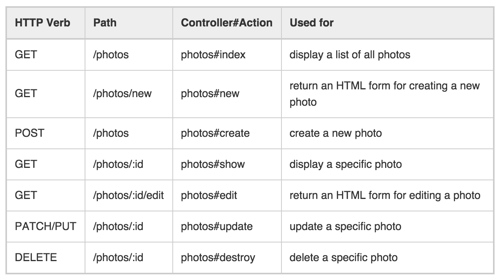

# Rails Forms, Validations, and Error Handling

## Exercises

### Set up

1. Clone this repo.
2. Run `rake db:create` to make your database. *Note:* If you already run into an error where you already have the database, run `rake db:drop` and then create your database again.
3. Start your app with `rails server`.
4. Navigate to `localhost:3000` – you should see the Owner's index page.


### Goal: Show me the Pets

**Setting up your Pets Controller and Routes**

1. In `config/routes.rb`, add `resources :pets` to the `resources :owners do ... end` block. This will give you access to all seven RESTful routes for Pets.
  ```ruby
  resources :owners do
    resources :pets
  end
  ```
  Doing this will generate RESTful routes for your pets resource. Adding `resources :pets` inside of the `resources :owners` block means that the pet routes will be nested inside of the owner routes.

  If you run `rake routes` in your Terminal, the output should look like this:

  ```bash
  Prefix Verb   URI Pattern                               Controller#Action
          root GET    /                                         owners#index
    owner_pets GET    /owners/:owner_id/pets(.:format)          pets#index
               POST   /owners/:owner_id/pets(.:format)          pets#create
 new_owner_pet GET    /owners/:owner_id/pets/new(.:format)      pets#new
edit_owner_pet GET    /owners/:owner_id/pets/:id/edit(.:format) pets#edit
     owner_pet GET    /owners/:owner_id/pets/:id(.:format)      pets#show
               PATCH  /owners/:owner_id/pets/:id(.:format)      pets#update
               PUT    /owners/:owner_id/pets/:id(.:format)      pets#update
               DELETE /owners/:owner_id/pets/:id(.:format)      pets#destroy
        owners GET    /owners(.:format)                         owners#index
               POST   /owners(.:format)                         owners#create
     new_owner GET    /owners/new(.:format)                     owners#new
    edit_owner GET    /owners/:id/edit(.:format)                owners#edit
         owner GET    /owners/:id(.:format)                     owners#show
               PATCH  /owners/:id(.:format)                     owners#update
               PUT    /owners/:id(.:format)                     owners#update
               DELETE /owners/:id(.:format)                     owners#destroy
  ```

  Looks a lot like the Rails routing chart, right?

  

  Read up on [Nested Resources](http://guides.rubyonrails.org/routing.html#nested-resources).

1. Generate a Pets controllers using `rails g controller Pets`. This will create a file like this:

  ```ruby
  class PetsController < ApplicationController
    # routing actions go here
  end
  ```

2. Define a method in `pets_controller.rb` called `new` and a method called `create`. In **both** methods, assign an instance variable `@pet` to `Pet.new`. Assign an instance variable `@owner` to `Owner.find(params[:owner_id])`.

3. Use an `if / else` block (after your assignment of `@owner` and  `@pet`) in `PetsController#create` to handle valid and invalid form submissions.
  ```ruby
    if @pet.save
      @owner.pets << @pet
      redirect_to @owner
    else
      render 'new'
    end
  ```

### Let's Make a Pet

**Using `form_for` to create your Pet Form**

1. Create a file in your `views/pets` directory called `new.html.erb`.
2. Use `form_for` to create a form for `@pet`.
3. Add an errors `<div>` so that an invalid form submission will cause the page to render with the errors displayed.

**NOTE:** If you need a refresher on syntax for `form_for` and the errors, refer to the README for examples or look at `views/owners/new.html.erb`.

But wait, we need a model to use with `form_for`! Let's build one!


### Making Your Pet Model and Migration

Generate a Pet model using `rails generate model Pet`. This will create a model file like this:

```ruby
class Pet < ActiveRecord::Base
end
```

And a corresponding migration file, like this:

```ruby
class CreatePets < ActiveRecord::Migration
  def change
    create_table :pets do |t|
      # attributes go here
      t.timestamps null: false
    end
  end
end
```

1. Give your Pet table a `name` attribute in the migration using `t.string :name`. This is similar to how you defined your model schemas in Mongoose.
2. Add a validation to your `pet.rb` model that requires the `presence` of `name` to be `true`. Also require `name` to be at least 3 characters. See the [ActiveRecord validation](http://edgeguides.rubyonrails.org/active_record_validations.html#length) docs for guidance.
3. Associate your Pet model with an Owner. Use `belongs_to :owner`.
4. Generate a new migration to add a foreign key, `owner_id` to your Pets table. Use `rails g migration AddOwnerIdToPet owner_id:integer`.
5. Run `rake db:migrate` to get your database up to date.


If all is right, you should be able to create new pets and associate them with their owners. Additionally, your awesome error handling should display informative messages on how to properly submit your forms. Great job!

## Stretch: Make update forms, add more validations

- In either `owners_controller.rb`, create `edit` and `update` methods, the former renders a form to edit the owner, and later handles the `PUT` request.
- Add new attributes to your models with new migrations using `rails g migration Add<SOMEATTRIBUTE>To<MODELNAME>`. Add validations for these new attributes in the models files (`owner.rb` and `pet.rb`). For example:
  - Add a breed attribute to the `Pet` model by creating a new migration. Add a validation for `breed` in your `models/pet.rb` file. Edit your Pet creation form to include the new `breed` attribute.
  - Add a email attribute to the `Owner` model by creating a new migration. Add a validation for `email` in your `models/Owner.rb` file. Validate the email using a [Regular Expression](http://edgeguides.rubyonrails.org/active_record_validations.html#format) Edit your Owner creation form to include the new `email` attribute.
